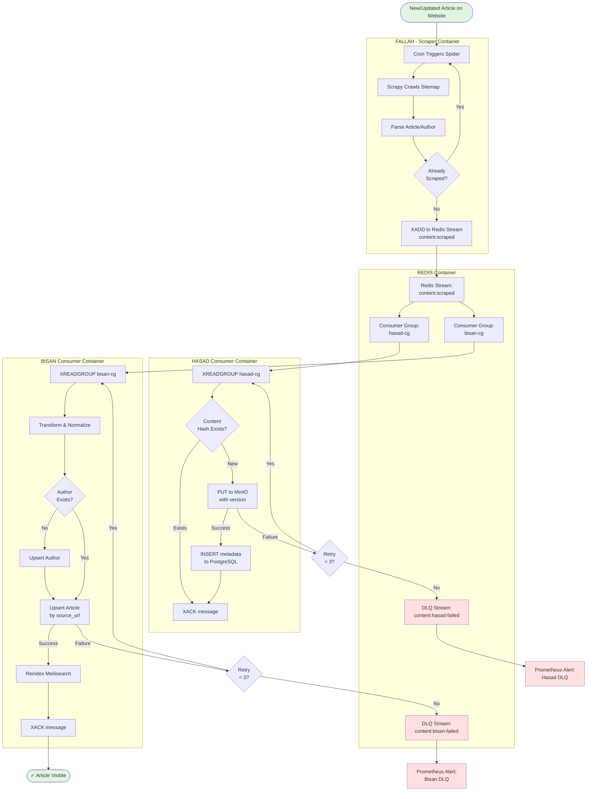
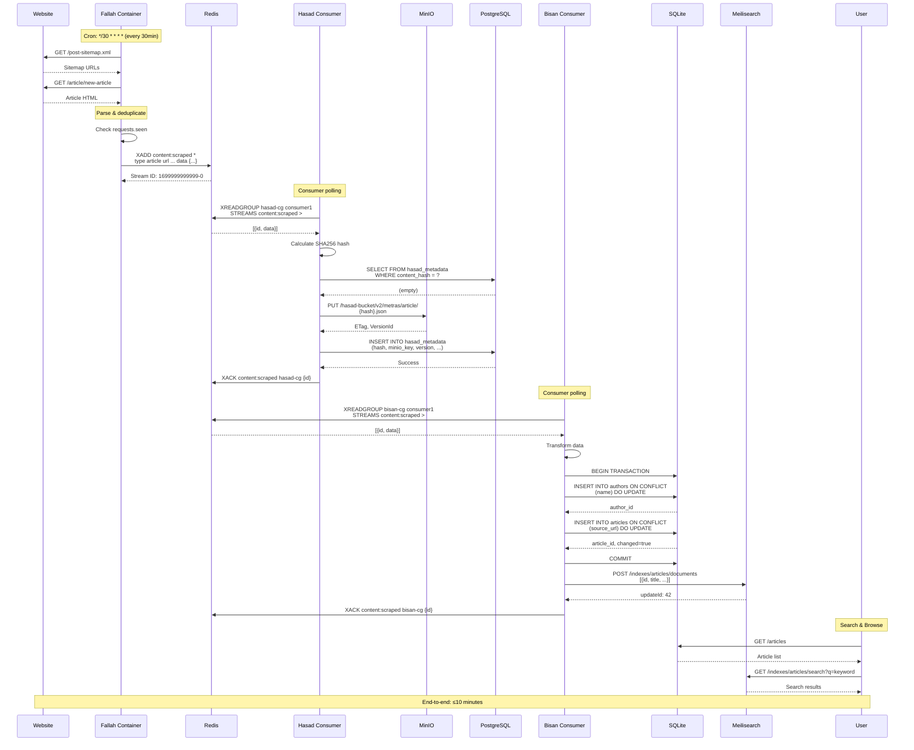
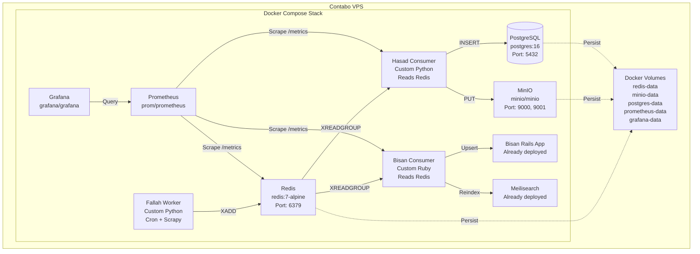

# Automated Self-Healing Pipeline: Fallah → Hasad → Bisan (Self-Hosted)

## Executive Summary

This document designs a **self-hosted, event-driven pipeline** running entirely on Contabo VPS to automate content flow from web scraping (Fallah) through persistent storage (Hasad) to user-facing application (Bisan). Using **Redis Streams** for pub/sub messaging, **PostgreSQL** for metadata, and **MinIO** for object storage, we achieve **≤10-minute latency** at **zero cloud costs**. The solution includes: (1) version-controlled storage with deduplication, (2) idempotent sync consumers with dead-letter queues, (3) zero-downtime Meilisearch reindexing, (4) comprehensive monitoring with Prometheus/Grafana, and (5) phased migration with feature flags. All components run as Docker containers on single Contabo VPS. Estimated effort: 3-4 weeks implementation.

---

## Table of Contents

1. [Architecture Comparison](#architecture-comparison)
2. [Recommended Architecture](#recommended-architecture)
3. [Component Diagrams](#component-diagrams)
4. [Storage & Versioning (Hasad)](#storage--versioning-hasad)
5. [Sync to Bisan](#sync-to-bisan)
6. [Operational Concerns](#operational-concerns)
7. [Acceptance Tests](#acceptance-tests)
8. [Migration Plan](#migration-plan)
9. [Risk Register](#risk-register)
10. [Implementation Backlog](#implementation-backlog)
11. [Appendix](#appendix)

---

## Architecture Comparison

### Option 1: Scheduled Polling (File-Based)

**How it works:**
- Fallah runs on cron schedule (e.g., every 6 hours)
- Writes NDJSON files to shared directory
- Bisan polls directory for new files (e.g., every 15 minutes)
- Imports changed files

**Pros:**
- ✅ Simple to implement (minimal changes)
- ✅ No new infrastructure
- ✅ Works with current system
- ✅ Zero additional cost

**Cons:**
- ❌ High latency (6h + 15min = ~6.25 hours)
- ❌ Inefficient (reads all files)
- ❌ No granular retry
- ❌ Tight coupling
- ❌ File locking issues

### Option 2: Event-Driven with Redis Streams (Recommended)

**How it works:**
- Fallah publishes events to Redis Stream per scraped item
- Hasad consumer subscribes, stores with versioning
- Bisan consumer subscribes, upserts to SQLite + reindexes
- Dead-letter streams catch failures for replay

**Pros:**
- ✅ Low latency (≤10 minutes)
- ✅ Decoupled components
- ✅ Granular retry per message
- ✅ Scalable (add workers)
- ✅ Real-time updates
- ✅ Built-in observability
- ✅ **100% free & self-hosted**

**Cons:**
- ❌ More complex setup
- ❌ Requires Redis (lightweight)
- ❌ Need monitoring setup

### Option 3: Database-Based Queue (PostgreSQL)

**How it works:**
- Fallah inserts rows into PostgreSQL queue table
- Consumers poll and lock rows (SELECT FOR UPDATE SKIP LOCKED)
- Workers process and mark complete

**Pros:**
- ✅ Transactional guarantees
- ✅ No additional infrastructure (use existing PG)
- ✅ Simple queries

**Cons:**
- ❌ Higher database load
- ❌ Slower than Redis
- ❌ Polling overhead
- ❌ Table bloat over time

### Decision Matrix

| Criterion | Weight | Polling | Redis Streams | PG Queue |
|-----------|--------|---------|---------------|----------|
| **Latency (≤10 min)** | 30% | ❌ 0/10 | ✅ 10/10 | ✅ 7/10 |
| **Scalability** | 20% | ❌ 3/10 | ✅ 9/10 | ✅ 6/10 |
| **Reliability** | 25% | ❌ 4/10 | ✅ 9/10 | ✅ 8/10 |
| **Simplicity** | 15% | ✅ 8/10 | ✅ 6/10 | ✅ 7/10 |
| **Cost** | 10% | ✅ 10/10 | ✅ 10/10 | ✅ 10/10 |
| **Weighted Score** | | **4.0/10** | **8.6/10** | **7.2/10** |

**RECOMMENDATION: Event-Driven with Redis Streams**

Redis Streams provides the best balance of performance, reliability, and simplicity for a self-hosted solution. It's lightweight (~50MB RAM), battle-tested, and purpose-built for this exact use case.

---

## Recommended Architecture

### High-Level Overview

```
                  ┌─────────────────────────────────────┐
                  │     CONTABO VPS (185.185.82.142)    │
                  │         Ubuntu 24.04                 │
                  │    RAM: 4GB | CPU: 4 vCPU           │
                  └─────────────────────────────────────┘
                                  │
        ┌─────────────────────────┼─────────────────────────┐
        │                         │                         │
        ▼                         ▼                         ▼
┌────────────────┐     ┌────────────────┐      ┌────────────────┐
│ Docker Network │     │ Docker Network │      │ Docker Network │
│   "fallah"     │     │    "hasad"     │      │    "bisan"     │
└────────────────┘     └────────────────┘      └────────────────┘


┌─────────────────────────────────────────────────────────────────┐
│                    SOURCE WEBSITES                               │
│            (metras.co, qudsn.co, ...)                           │
└─────────────────────────────────────────────────────────────────┘
                            │
                            │ HTTP (sitemap crawl)
                            ▼
┌─────────────────────────────────────────────────────────────────┐
│                   FALLAH (Scraper Container)                     │
│  • Scrapy spiders on schedule                                   │
│  • Rate limited: 1 req/sec                                      │
│  • Publishes to Redis Stream: "content:scraped"                 │
│  • Container: fallah-worker                                     │
└─────────────────────────────────────────────────────────────────┘
                            │
                            │ RPUSH to stream
                            ▼
┌─────────────────────────────────────────────────────────────────┐
│              REDIS (Message Broker Container)                    │
│  Streams:                                                        │
│  • content:scraped (main stream)                                │
│  • content:hasad-failed (DLQ)                                   │
│  • content:bisan-failed (DLQ)                                   │
│  • Container: redis:7-alpine                                    │
│  • Persistence: AOF enabled                                     │
│  • Volume: /data → redis-data                                   │
└─────────────────────────────────────────────────────────────────┘
              │                                      │
              │ Consumer Group: hasad                │ Consumer Group: bisan
              ▼                                      ▼
┌─────────────────────┐                   ┌──────────────────────────┐
│  HASAD Consumer     │                   │    BISAN Consumer        │
│  Container          │                   │    Container             │
│                     │                   │                          │
│  • Reads stream     │                   │  • Reads stream          │
│  • Stores to MinIO  │                   │  • Upserts to SQLite     │
│  • Updates PG       │                   │  • Reindexes Meilisearch │
│  • ACKs message     │                   │  • ACKs message          │
└─────────────────────┘                   └──────────────────────────┘
            │                                         │
            ▼                                         ▼
┌─────────────────────┐                   ┌──────────────────────────┐
│  HASAD STORAGE      │                   │   BISAN PRODUCTION       │
│                     │                   │                          │
│  • MinIO (S3-like)  │                   │  • SQLite Database       │
│  • PostgreSQL       │                   │  • Meilisearch Index     │
│    (metadata)       │                   │  • Rails App (Puma)      │
│  • Versioning       │                   │                          │
│  • Deduplication    │                   │  Already deployed!       │
└─────────────────────┘                   └──────────────────────────┘


┌─────────────────────────────────────────────────────────────────┐
│                 MONITORING (Optional but Recommended)            │
│                                                                  │
│  • Prometheus (metrics scraping)                                │
│  • Grafana (dashboards)                                         │
│  • Container: prom/prometheus, grafana/grafana                  │
└─────────────────────────────────────────────────────────────────┘
```

### Component Responsibilities

**Fallah (Producer)**:
- Scrapy spider runs on schedule (cron inside container)
- Crawls source websites via sitemaps
- Extracts article + author data
- Publishes to Redis Stream: `XADD content:scraped * type article data {...}`
- Container restart policy: always

**Redis (Message Broker)**:
- Redis Streams for pub/sub
- Consumer groups for multiple consumers
- Automatic persistence (AOF)
- Dead-letter streams for failed messages
- Lightweight: ~50MB RAM usage

**Hasad Consumer**:
- Reads from Redis Stream with consumer group
- Stores raw content to MinIO with versioning
- Updates PostgreSQL metadata
- Content-based deduplication
- ACKs message only after successful storage
- On failure: retries 3x, then moves to DLQ

**Bisan Consumer**:
- Reads from Redis Stream with consumer group
- Transforms and normalizes data
- Upserts to SQLite (idempotent)
- Triggers Meilisearch reindex
- ACKs only after full commit
- On failure: retries 3x, then moves to DLQ

**MinIO (Object Storage)**:
- S3-compatible object storage
- Versioning enabled
- Stores article/author JSON
- Web UI on port 9001

**PostgreSQL (Metadata)**:
- Stores Hasad metadata
- Content hashes, versions, timestamps
- Indexes for fast lookups
- Already available on server

**Monitoring**:
- Prometheus scrapes metrics
- Grafana visualizes dashboards
- Alert rules for failures

---

## Component Diagrams

### Flowchart: End-to-End Pipeline



### Sequence Diagram: Happy Path



### Docker Compose Architecture



---

## Storage & Versioning (Hasad)

### Current State Problems

- ❌ Single NDJSON file grows indefinitely
- ❌ No version history
- ❌ No deduplication
- ❌ No metadata tracking
- ❌ Difficult to query

### New Architecture

**MinIO (S3-Compatible Storage)**:
```
Bucket: hasad-content
├── v2/
│   ├── metras/
│   │   ├── article/
│   │   │   ├── 5f4dcc3b5aa765d61d8327deb882cf99.json
│   │   │   └── ...
│   │   └── author/
│   │       └── ...
│   └── qudsn.co/
│       └── ...
└── legacy/
    └── (old NDJSON files)
```

**PostgreSQL Metadata Schema**:
```sql
CREATE TABLE hasad_metadata (
    id SERIAL PRIMARY KEY,
    content_hash VARCHAR(64) NOT NULL,
    source_name VARCHAR(100) NOT NULL,
    type VARCHAR(20) NOT NULL,  -- 'article' or 'author'
    url TEXT NOT NULL,
    minio_bucket VARCHAR(100) NOT NULL,
    minio_key TEXT NOT NULL,
    minio_version_id VARCHAR(100),
    content_size INT,
    scraped_at TIMESTAMPTZ NOT NULL DEFAULT NOW(),
    scraper_version VARCHAR(50),
    status VARCHAR(20) NOT NULL DEFAULT 'active',  -- active, superseded, deleted
    deleted_at TIMESTAMPTZ,
    deleted_reason TEXT,
    
    -- Indexes
    CONSTRAINT unique_content UNIQUE (content_hash, scraped_at)
);

CREATE INDEX idx_url ON hasad_metadata (url);
CREATE INDEX idx_content_hash ON hasad_metadata (content_hash);
CREATE INDEX idx_status ON hasad_metadata (status) WHERE status = 'active';
CREATE INDEX idx_source_type ON hasad_metadata (source_name, type);

-- Version tracking
CREATE TABLE hasad_versions (
    id SERIAL PRIMARY KEY,
    url TEXT NOT NULL,
    version_number INT NOT NULL,
    metadata_id INT NOT NULL REFERENCES hasad_metadata(id),
    created_at TIMESTAMPTZ NOT NULL DEFAULT NOW(),
    
    CONSTRAINT unique_url_version UNIQUE (url, version_number)
);

CREATE INDEX idx_url_versions ON hasad_versions (url, version_number DESC);
```

### Hasad Consumer Implementation

**Python Consumer (hasad-consumer.py)**:
```python
import redis
import json
import hashlib
import psycopg2
from minio import Minio
from datetime import datetime
import time
import logging

logging.basicConfig(level=logging.INFO)
logger = logging.getLogger(__name__)

class HasadConsumer:
    def __init__(self):
        # Redis connection
        self.redis = redis.Redis(
            host='redis',
            port=6379,
            decode_responses=True
        )
        
        # MinIO connection
        self.minio = Minio(
            'minio:9000',
            access_key='minioadmin',  # Change in production
            secret_key='minioadmin',
            secure=False
        )
        
        # Ensure bucket exists
        if not self.minio.bucket_exists('hasad-content'):
            self.minio.make_bucket('hasad-content')
        
        # PostgreSQL connection
        self.pg = psycopg2.connect(
            host='postgres',
            database='hasad',
            user='hasad',
            password='hasad_password'  # From env var in production
        )
        
        self.stream_name = 'content:scraped'
        self.consumer_group = 'hasad-cg'
        self.consumer_name = 'hasad-consumer-1'
        self.dlq_stream = 'content:hasad-failed'
        
        # Create consumer group if not exists
        try:
            self.redis.xgroup_create(
                self.stream_name,
                self.consumer_group,
                id='0',
                mkstream=True
            )
        except redis.ResponseError as e:
            if 'BUSYGROUP' not in str(e):
                raise
    
    def calculate_hash(self, data):
        """Calculate SHA256 hash of content"""
        content = json.dumps(data, sort_keys=True)
        return hashlib.sha256(content.encode()).hexdigest()
    
    def check_duplicate(self, content_hash):
        """Check if content already exists"""
        cursor = self.pg.cursor()
        cursor.execute("""
            SELECT id, minio_key FROM hasad_metadata
            WHERE content_hash = %s AND status = 'active'
            LIMIT 1
        """, (content_hash,))
        result = cursor.fetchone()
        cursor.close()
        return result is not None, result
    
    def store_to_minio(self, source_name, data_type, content_hash, data):
        """Store content to MinIO"""
        # Generate object key
        minio_key = f"v2/{source_name}/{data_type}/{content_hash}.json"
        
        # Convert to JSON bytes
        content_bytes = json.dumps(data, ensure_ascii=False, indent=2).encode('utf-8')
        
        # Upload to MinIO
        result = self.minio.put_object(
            'hasad-content',
            minio_key,
            io.BytesIO(content_bytes),
            length=len(content_bytes),
            content_type='application/json'
        )
        
        logger.info(f"Stored to MinIO: {minio_key} (etag: {result.etag})")
        return minio_key, result.etag, len(content_bytes)
    
    def store_metadata(self, content_hash, source_name, data_type, url, 
                       minio_key, version_id, content_size):
        """Store metadata to PostgreSQL"""
        cursor = self.pg.cursor()
        
        # Mark previous versions as superseded
        cursor.execute("""
            UPDATE hasad_metadata
            SET status = 'superseded'
            WHERE url = %s AND status = 'active'
        """, (url,))
        
        # Insert new version
        cursor.execute("""
            INSERT INTO hasad_metadata 
            (content_hash, source_name, type, url, minio_bucket, minio_key,
             minio_version_id, content_size, scraper_version)
            VALUES (%s, %s, %s, %s, %s, %s, %s, %s, %s)
            RETURNING id
        """, (
            content_hash, source_name, data_type, url,
            'hasad-content', minio_key, version_id, content_size,
            'fallah-v1.0.0'
        ))
        
        metadata_id = cursor.fetchone()[0]
        
        # Get version number for this URL
        cursor.execute("""
            SELECT COALESCE(MAX(version_number), 0) + 1
            FROM hasad_versions
            WHERE url = %s
        """, (url,))
        version_number = cursor.fetchone()[0]
        
        # Insert version record
        cursor.execute("""
            INSERT INTO hasad_versions (url, version_number, metadata_id)
            VALUES (%s, %s, %s)
        """, (url, version_number, metadata_id))
        
        self.pg.commit()
        cursor.close()
        
        logger.info(f"Stored metadata: {url} (version {version_number})")
        return metadata_id
    
    def process_message(self, message_id, data):
        """Process single message"""
        try:
            # Extract data
            msg_type = data.get('type', 'article')
            source_name = data.get('source_name', 'unknown')
            url = data.get('url')
            content = data.get('data', {})
            
            if not url:
                logger.warning(f"Message {message_id} missing URL, skipping")
                return True  # ACK anyway
            
            # Calculate content hash
            content_hash = self.calculate_hash(content)
            
            # Check if duplicate
            is_duplicate, existing = self.check_duplicate(content_hash)
            if is_duplicate:
                logger.info(f"Duplicate content: {url} (hash: {content_hash[:8]}...)")
                return True  # ACK, already stored
            
            # Store to MinIO
            minio_key, version_id, size = self.store_to_minio(
                source_name, msg_type, content_hash, content
            )
            
            # Store metadata to PostgreSQL
            self.store_metadata(
                content_hash, source_name, msg_type, url,
                minio_key, version_id, size
            )
            
            logger.info(f"Successfully processed: {url}")
            return True
            
        except Exception as e:
            logger.error(f"Error processing message {message_id}: {e}")
            return False
    
    def run(self):
        """Main consumer loop"""
        logger.info(f"Starting Hasad consumer: {self.consumer_name}")
        retry_counts = {}
        
        while True:
            try:
                # Read messages from stream
                messages = self.redis.xreadgroup(
                    self.consumer_group,
                    self.consumer_name,
                    {self.stream_name: '>'},
                    count=10,
                    block=5000  # 5 second timeout
                )
                
                if not messages:
                    continue
                
                for stream, msg_list in messages:
                    for message_id, data in msg_list:
                        # Process message
                        success = self.process_message(message_id, data)
                        
                        if success:
                            # ACK message
                            self.redis.xack(
                                self.stream_name,
                                self.consumer_group,
                                message_id
                            )
                            # Remove from retry tracking
                            retry_counts.pop(message_id, None)
                        else:
                            # Track retries
                            retry_counts[message_id] = retry_counts.get(message_id, 0) + 1
                            
                            if retry_counts[message_id] >= 3:
                                # Move to DLQ after 3 failures
                                logger.error(f"Moving to DLQ: {message_id}")
                                self.redis.xadd(self.dlq_stream, data)
                                self.redis.xack(
                                    self.stream_name,
                                    self.consumer_group,
                                    message_id
                                )
                                retry_counts.pop(message_id)
            
            except Exception as e:
                logger.error(f"Consumer error: {e}")
                time.sleep(5)

if __name__ == '__main__':
    consumer = HasadConsumer()
    consumer.run()
```

### Docker Compose for Hasad Stack

**docker-compose.hasad.yml**:
```yaml
version: '3.8'

services:
  redis:
    image: redis:7-alpine
    container_name: hasad-redis
    ports:
      - "6379:6379"
    volumes:
      - redis-data:/data
    command: redis-server --appendonly yes
    restart: unless-stopped
    healthcheck:
      test: ["CMD", "redis-cli", "ping"]
      interval: 10s
      timeout: 3s
      retries: 3
