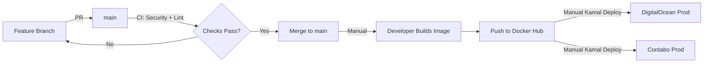
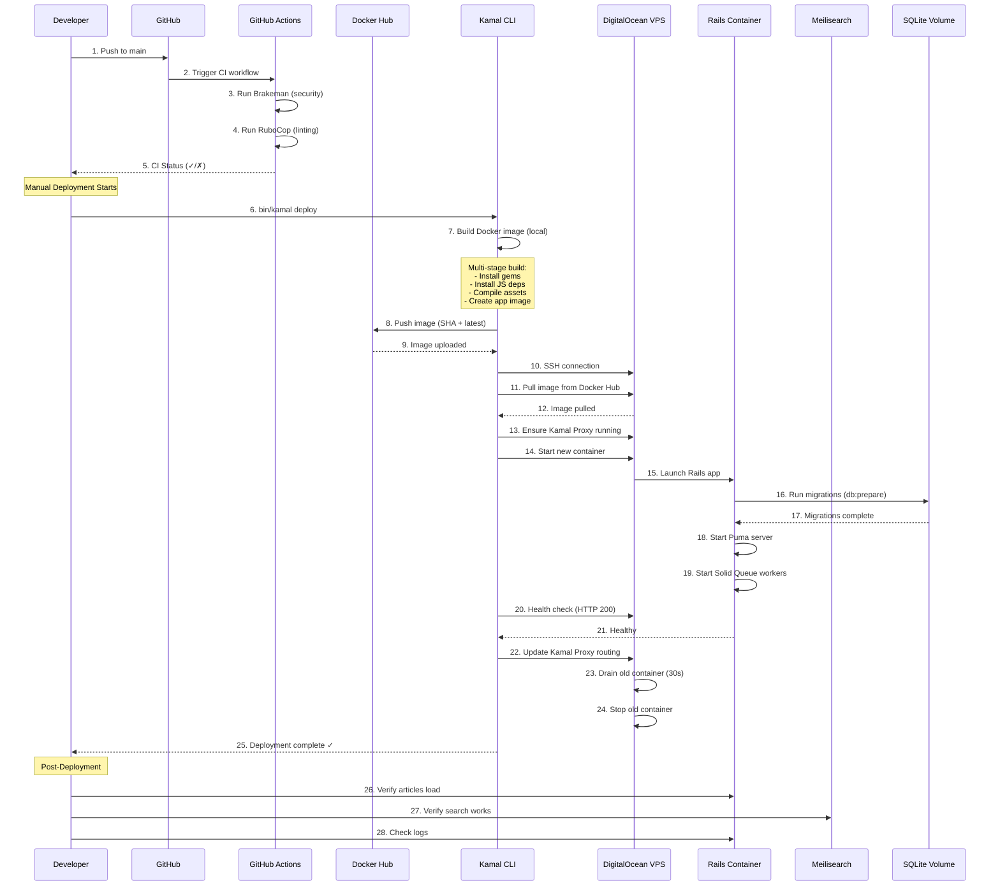

# Bisan Application: End-to-End Deployment Runbook

## Executive Summary

Bisan is a Rails 7.2 application for Palestinian content aggregation, deployed using **Kamal** to DigitalOcean and Contabo VPS servers. The stack includes **SQLite** for data persistence, **Meilisearch** for full-text search, and **Solid Queue** for background jobs (running in-process via Puma). Docker images are built locally, pushed to Docker Hub, and deployed via SSH. CI/CD runs security scans and linting on pull requests via **GitHub Actions**. Assets are compiled during Docker build and served via Rails asset pipeline with fingerprinting. Production uses **Kamal Proxy** for automatic SSL/TLS (Let's Encrypt). The deployment is manual-trigger only—no auto-deploy from main branch. Database migrations run automatically during deployment. **Zero-downtime deployments** are achieved through Kamal's rolling restart strategy.

---

## 📋 Table of Contents

1. [Architecture Overview](#architecture-overview)
2. [Environments & Flow](#environments--flow)
3. [Complete Deployment Runbook](#complete-deployment-runbook)
4. [Database Lifecycle](#database-lifecycle)
5. [Meilisearch Management](#meilisearch-management)
6. [Assets Pipeline](#assets-pipeline)
7. [Infrastructure & Orchestration](#infrastructure--orchestration)
8. [Configuration & Secrets](#configuration--secrets)
9. [Monitoring & Health Checks](#monitoring--health-checks)
10. [Rollback Procedures](#rollback-procedures)
11. [Common Failure Modes](#common-failure-modes)
12. [Engineer Checklist](#engineer-checklist)
13. [Glossary](#glossary)
14. [Appendix: Commands & Configs](#appendix-commands--configs)

---

## Architecture Overview

```
┌─────────────────────────────────────────────────────────────┐
│                     Developer Workstation                    │
│  ┌──────────────┐  ┌──────────────┐  ┌──────────────┐      │
│  │  Git/GitHub  │  │  Local Rails │  │ Docker Build │      │
│  │   (main)     │  │  Development │  │  (amd64)     │      │
│  └──────────────┘  └──────────────┘  └──────────────┘      │
└─────────────────────────────────────────────────────────────┘
                          │
                          ▼
        ┌─────────────────────────────────────┐
        │      GitHub Actions CI/CD            │
        │  • Security scan (Brakeman)          │
        │  • Linting (RuboCop)                 │
        │  • Runs on PR + push to main         │
        └─────────────────────────────────────┘
                          │
                          ▼ (Manual Trigger)
        ┌─────────────────────────────────────┐
        │         Docker Hub Registry          │
        │  Image: abukhadijah/bisan:latest     │
        │         abukhadijah/bisan:{SHA}      │
        └─────────────────────────────────────┘
                          │
             ┌────────────┴───────────┐
             ▼                        ▼
┌──────────────────────┐   ┌──────────────────────┐
│  DigitalOcean VPS    │   │   Contabo VPS        │
│  104.248.18.215      │   │   185.185.82.142     │
│  ┌────────────────┐  │   │  ┌────────────────┐  │
│  │ Kamal Proxy    │  │   │  │ Kamal Proxy    │  │
│  │ (SSL/TLS)      │  │   │  │ (SSL/TLS)      │  │
│  └────────────────┘  │   │  └────────────────┘  │
│  ┌────────────────┐  │   │  ┌────────────────┐  │
│  │ Rails App      │  │   │  │ Rails App      │  │
│  │ (Puma+Thrust)  │  │   │  │ (Puma+Thrust)  │  │
│  │ Solid Queue    │  │   │  │ Solid Queue    │  │
│  └────────────────┘  │   │  └────────────────┘  │
│  ┌────────────────┐  │   │  ┌────────────────┐  │
│  │ Meilisearch    │  │   │  │ Meilisearch    │  │
│  │ v1.5           │  │   │  │ v1.5           │  │
│  └────────────────┘  │   │  └────────────────┘  │
│  ┌────────────────┐  │   │  ┌────────────────┐  │
│  │ SQLite DB      │  │   │  │ SQLite DB      │  │
│  │ (Docker Vol)   │  │   │  │ (Docker Vol)   │  │
│  └────────────────┘  │   │  └────────────────┘  │
└──────────────────────┘   └──────────────────────┘
```

**Key Components:**
- **Backend**: Rails 7.2 (Ruby 3.2.2)
- **Frontend**: Hotwire (Turbo + Stimulus), Tailwind CSS
- **Database**: SQLite (production + development)
- **Search**: Meilisearch v1.5
- **Jobs**: Solid Queue (in-process via Puma)
- **Web Server**: Puma + Thruster (HTTP/2 proxy)
- **Deployment**: Kamal 2.x
- **CI/CD**: GitHub Actions
- **Hosting**: DigitalOcean + Contabo VPS
- **CDN/Assets**: None (served directly from Rails)

---

## Environments & Flow

### Environment Types

| Environment | Purpose | Trigger | Approval | URL |
|------------|---------|---------|----------|-----|
| **Local** | Development | Manual `bin/dev` | N/A | http://localhost:3000 |
| **CI** | Testing/Linting | PR + Push to main | Auto | N/A |
| **DigitalOcean Production** | Primary production | Manual `bin/kamal deploy` | Developer | https://104.248.18.215.nip.io |
| **Contabo Production** | Secondary production | Manual `bin/kamal deploy -c config/deploy.contabo.yml` | Developer | https://185.185.82.142.nip.io |

### Git Flow



**Branch Strategy:**
- `main` - production-ready code
- Feature branches for all development
- No staging environment currently (TODO: Add staging)

**Deployment Triggers:**
- ❌ No auto-deploy on merge to main
- ✅ Manual deployment via Kamal command
- ✅ CI runs on all PRs and main pushes (security + lint only)

---

## Complete Deployment Runbook

### Deployment Sequence Diagram



### Step-by-Step Deployment

#### Phase 1: Pre-Deployment (Developer Machine)

**Step 1: Verify Local Changes**
```bash
# Run tests locally
bin/rails test

# Check for security issues
bin/brakeman

# Check code style
bin/rubocop

# Test asset compilation
RAILS_ENV=production bin/rails assets:precompile
```

**Step 2: Commit and Push**
```bash
git add .
git commit -m "feat: your feature description"
git push origin main
```

**Step 3: Wait for CI**
- Navigate to GitHub Actions
- Verify all checks pass (security scan + linting)
- If failed, fix issues and push again

#### Phase 2: Build & Push (Developer Machine)

**Step 4: Set Environment Variables**
```bash
# Set Docker Hub credentials
export KAMAL_REGISTRY_PASSWORD="your_docker_hub_token"

# Verify .kamal/secrets file exists with RAILS_MASTER_KEY
cat .kamal/secrets
```

**Step 5: Choose Deployment Target**

For DigitalOcean:
```bash
bin/kamal deploy
```

For Contabo:
```bash
bin/kamal deploy -c config/deploy.contabo.yml
```

**What Happens During `kamal deploy`:**
1. Builds Docker image locally (multi-stage build)
2. Tags image with git SHA and `latest`
3. Pushes to Docker Hub (abukhadijah/bisan)
4. SSHs to target server
5. Pulls image from Docker Hub
6. Starts new container with new image
7. Runs health checks
8. Updates Kamal Proxy routing
9. Drains and stops old container

#### Phase 3: Deployment Execution (Automated by Kamal)

**Step 6: Image Build**
```
Building Docker image...
- Stage 1: Base (Ruby 3.2.2-slim)
- Stage 2: Build (install gems, node, compile assets)
- Stage 3: Final (copy artifacts, create rails user)
Duration: ~3-5 minutes
```

**Step 7: Push to Registry**
```
Pushing to Docker Hub...
- abukhadijah/bisan:8677fc93d58df7f2815971ecac95cc4396510f26
- abukhadijah/bisan:latest
Duration: ~1-2 minutes (depends on changes)
```

**Step 8: Server Deployment**
```
Deploying to 104.248.18.215...
- Login to Docker Hub
- Pull latest image
- Ensure Kamal Proxy running
- Stop old container (if exists)
- Start new container
- Run database migrations (automatic)
- Health check (wait for HTTP 200)
- Update proxy routing
- Drain old container (30s grace period)
Duration: ~2-3 minutes
```

#### Phase 4: Post-Deployment Verification

**Step 9: Automated Health Checks**
Kamal automatically verifies:
- Container is running
- HTTP port responding (80)
- Returns HTTP 200 status

**Step 10: Manual Verification**
```bash
# Check application logs
bin/kamal app logs -c config/deploy.contabo.yml

# Test the website
curl -I https://185.185.82.142.nip.io
# Should return: HTTP/2 200

# Verify articles are loading
curl -s https://185.185.82.142.nip.io | grep "article-card"

# Check database count
bin/kamal app exec -c config/deploy.contabo.yml 'bin/rails runner "puts Article.count"'
```

**Step 11: Verify Search Functionality**
```bash
# Test Meilisearch is accessible
ssh -i ~/bisan root@185.185.82.142 'docker ps | grep meilisearch'

# Check search indexes
bin/kamal app exec -c config/deploy.contabo.yml \
  'bin/rails runner "puts Article.search(\"*\").count"'
```

#### Phase 5: Rollback (If Needed)

**Step 12: Immediate Rollback**
If deployment fails or issues detected:
```bash
# Rollback to previous version
bin/kamal rollback -c config/deploy.contabo.yml
```

---

## Database Lifecycle

### Database Architecture

**Technology**: SQLite 3
**Location**: Docker volume (`bisan_storage:/rails/storage`)
**File**: `storage/production.sqlite3`
**Size**: ~80MB (5,208 articles, 1,000 authors)

### Migration Strategy

**Automatic Migrations:**
```yaml
# bin/docker-entrypoint runs on container start
#!/bin/bash
set -e

# Prepare database (creates + migrates)
./bin/rails db:prepare

exec "${@}"
```

**Manual Migration Commands:**
```bash
# Run migrations
bin/kamal app exec 'bin/rails db:migrate'

# Check migration status
bin/kamal app exec 'bin/rails db:migrate:status'

# Rollback last migration
bin/kamal app exec 'bin/rails db:rollback'

# Rollback to specific version
bin/kamal app exec 'bin/rails db:migrate:down VERSION=20250901110628'
```

### Zero-Downtime Database Strategy

**Current Setup (SQLite):**
- ❌ No read replicas (SQLite limitation)
- ❌ No connection pooling across containers
- ✅ Migrations run before app starts (safe for additive changes)
- ✅ File-based, no network latency

**Safe Migration Practices:**
1. **Additive Changes** (Safe):
   - Adding columns with defaults
   - Adding indexes
   - Adding new tables

2. **Destructive Changes** (Requires downtime):
   - Removing columns
   - Renaming columns
   - Changing column types

**Recommended Pattern for Breaking Changes:**
```ruby
# Step 1: Add new column (deploy)
add_column :articles, :new_field, :string

# Step 2: Backfill data (deploy)
Article.find_each { |a| a.update(new_field: a.old_field) }

# Step 3: Update code to use new_field (deploy)

# Step 4: Remove old column (deploy)
remove_column :articles, :old_field
```

### Database Backup & Restore

**Backup Production Database:**
```bash
# From DigitalOcean
ssh -i ~/bisan root@104.248.18.215 \
  'docker run --rm -v bisan_storage:/source alpine cat /source/production.sqlite3' \
  > backup_do_$(date +%Y%m%d).sqlite3

# From Contabo
ssh -i ~/bisan root@185.185.82.142 \
  'docker run --rm -v bisan_contabo_storage:/source alpine cat /source/production.sqlite3' \
  > backup_contabo_$(date +%Y%m%d).sqlite3
```

**Restore Database:**
```bash
# 1. Upload backup to server
scp -i ~/bisan backup.sqlite3 root@185.185.82.142:~/production.sqlite3

# 2. Copy to Docker volume with correct permissions
ssh -i ~/bisan root@185.185.82.142 \
  'docker run --rm -v bisan_contabo_storage:/target -v /root:/source alpine sh -c \
  "cp /source/production.sqlite3 /target/production.sqlite3 && chown 1000:1000 /target/production.sqlite3"'

# 3. Restart application
export KAMAL_REGISTRY_PASSWORD="your_token"
bin/kamal app boot -c config/deploy.contabo.yml
```

**Seeding Data:**
```bash
# Run seed data
bin/kamal app exec 'bin/rails db:seed'

# Import from JSON dumps
bin/kamal app exec 'bin/rails ingest:metras_full'
```

---

## Meilisearch Management

### Configuration

**Version**: v1.5
**Host**: `http://bisan-meilisearch:7700` (Docker network)
**Master Key**: `dev_meili_master_key_123` (TODO: Rotate in production)
**Data Volume**: `data:/meili_data` (DigitalOcean) or `contabo_data:/meili_data` (Contabo)

### Index Management

**Indexed Models:**
- `Article` (title, excerpt, body)
- `Author` (name, bio)

**Index Configuration:**
```ruby
# app/models/article.rb
meilisearch do
  attribute :title, :excerpt, :body
  searchable_attributes [:title, :excerpt, :body]
  attributes_to_highlight ["*"]
  pagination max_total_hits: 10000
end
```

### Reindexing Operations

**Full Reindex (After Data Import):**
```bash
# Reindex all models
bin/kamal app exec -c config/deploy.contabo.yml \
  'bin/rails runner "Article.reindex!; Author.reindex!"'
```

**Clear and Reindex:**
```bash
# Clear existing indexes and rebuild
bin/kamal app exec -c config/deploy.contabo.yml \
  'bin/rails runner "Article.clear_index!; Author.clear_index!; Article.reindex!; Author.reindex!"'
```

**Check Index Status:**
```bash
# Count indexed documents
bin/kamal app exec 'bin/rails runner "puts Article.ms_index.stats"'
```

### Meilisearch Operations

**View Logs:**
```bash
ssh -i ~/bisan root@185.185.82.142 'docker logs bisan-meilisearch'
```

**Restart Meilisearch:**
```bash
export KAMAL_REGISTRY_PASSWORD="your_token"
bin/kamal accessory restart meilisearch -c config/deploy.contabo.yml
```

**Access Meilisearch UI:**
```bash
# Forward port to local machine
ssh -i ~/bisan -L 7700:localhost:7700 root@185.185.82.142
# Then open http://localhost:7700 in browser
```

### Zero-Downtime Search Strategy

**Current Approach:**
- Single Meilisearch instance per environment
- Reindexing happens in-place (brief search unavailability during reindex)

**Recommended for Zero-Downtime (TODO):**
```bash
# 1. Create new index with suffix
Article.ms_index.create_index("articles_#{timestamp}")

# 2. Reindex to new index
Article.reindex!(index_name: "articles_#{timestamp}")

# 3. Swap index alias
Article.ms_index.swap_indexes(
  { indexes: ["articles_#{timestamp}", "articles"] }
)

# 4. Delete old index
Article.ms_index.delete_index("articles")
```

---

## Assets Pipeline

### Build Process

**Tools:**
- **JavaScript**: esbuild (bundling)
- **CSS**: Tailwind CSS (PostCSS)
- **Pipeline**: Rails Asset Pipeline (Propshaft)

### Compilation Steps

**During Docker Build:**
```dockerfile
# Dockerfile - Build stage
RUN yarn install --immutable
RUN bundle exec bootsnap precompile app/ lib/
RUN SECRET_KEY_BASE_DUMMY=1 SKIP_YARN_INSTALL=1 ./bin/rails assets:precompile
```

**What Gets Compiled:**
```
app/assets/builds/
├── application-b8eb8c6c.css  (Tailwind output + fingerprint)
└── application-aba8c4ee.js   (esbuild bundle + fingerprint)
```

### Asset Fingerprinting

**Enabled**: Yes (SHA256 hash appended to filenames)
**Purpose**: Cache busting for browser caching

**Example:**
```html
<link rel="stylesheet" href="/assets/application-b8eb8c6c.css" />
<script src="/assets/application-aba8c4ee.js" type="module"></script>
```

### Asset Serving

**Method**: Direct from Rails (via Thruster HTTP/2 proxy)
**Location**: `/rails/public/assets` (Docker volume mount)
**Caching**: Browser cache controlled via HTTP headers

**Kamal Config:**
```yaml
# config/deploy.yml
asset_path: /rails/public/assets
# Bridges assets between old and new containers during deployment
```

### CDN Strategy

**Current**: No CDN (TODO: Add CloudFlare or CloudFront)
**Recommendation**: 
```bash
# Upload assets to S3 after build
aws s3 sync public/assets/ s3://bisan-assets/assets/ \
  --cache-control "public, max-age=31536000, immutable"

# Invalidate CloudFront cache
aws cloudfront create-invalidation \
  --distribution-id EXXXXXXXXXXXXX \
  --paths "/assets/*"
```

---

## Infrastructure & Orchestration

### Kamal Architecture

**Kamal Proxy** (Reverse Proxy):
- Handles incoming HTTP/HTTPS traffic
- Automatic SSL/TLS via Let's Encrypt
- Zero-downtime deployments via traffic switching
- Listens on ports 80 (HTTP) and 443 (HTTPS)

**Application Container:**
- Runs Rails app via Puma + Thruster
- Exposes port 80 internally
- Connected to `kamal` Docker network
- Mounts: 
  - `bisan_storage:/rails/storage` (database + uploads)
  - `bisan_db:/rails/db` (migrations + schemas)
  - Asset volume for static files

**Meilisearch Container:**
- Separate accessory service
- Exposes port 7700
- Connected to `kamal` Docker network
- Persistent volume: `data:/meili_data`

### Docker Compose Equivalent

```yaml
# This is what Kamal creates (conceptual)
version: '3.8'
services:
  kamal-proxy:
    image: basecamp/kamal-proxy:v0.9.0
    ports:
      - "80:80"
      - "443:443"
    volumes:
      - kamal-proxy-config:/home/kamal-proxy/.config
    networks:
      - kamal
    restart: unless-stopped

  bisan-web:
    image: abukhadijah/bisan:latest
    environment:
      RAILS_ENV: production
      SOLID_QUEUE_IN_PUMA: "true"
      MEILISEARCH_HOST: http://bisan-meilisearch:7700
    volumes:
      - bisan_storage:/rails/storage
      - bisan_db:/rails/db
      - assets:/rails/public/assets
    networks:
      - kamal
    restart: unless-stopped

  bisan-meilisearch:
    image: getmeili/meilisearch:v1.5
    ports:
      - "7700:7700"
    environment:
      MEILI_MASTER_KEY: dev_meili_master_key_123
    volumes:
      - data:/meili_data
    networks:
      - kamal
    restart: unless-stopped

networks:
  kamal:
    driver: bridge

volumes:
  kamal-proxy-config:
  bisan_storage:
  bisan_db:
  assets:
  data:
```

### Server Specifications

| Server | Provider | RAM | CPU | Storage | IP |
|--------|----------|-----|-----|---------|-----|
| Primary | DigitalOcean | 2GB | 2 vCPU | 50GB SSD | 104.248.18.215 |
| Secondary | Contabo | 4GB | 4 vCPU | 100GB SSD | 185.185.82.142 |

### Firewall Rules (UFW)

```bash
# DigitalOcean & Contabo
ufw allow 22/tcp    # SSH
ufw allow 80/tcp    # HTTP
ufw allow 443/tcp   # HTTPS
ufw allow 7700/tcp  # Meilisearch (internal)
ufw allow 8080/tcp  # Kamal Proxy admin (optional)
ufw enable
```

### SSL/TLS Configuration

**Provider**: Let's Encrypt (via Kamal Proxy)
**Auto-renewal**: Yes
**Certificates**:
- DigitalOcean: `104.248.18.215.nip.io`
- Contabo: `185.185.82.142.nip.io`

**Kamal Proxy Config:**
```yaml
proxy:
  ssl: true
  host: 185.185.82.142.nip.io
```

---

## Configuration & Secrets

### Environment Variables

**Application Secrets:**
```bash
# .kamal/secrets (not committed to git)
KAMAL_REGISTRY_PASSWORD=dckr_pat_xxx  # Docker Hub token
RAILS_MASTER_KEY=xxx                   # Rails credentials key
```

**Runtime Configuration:**
```yaml
# config/deploy.yml
env:
  secret:
    - RAILS_MASTER_KEY  # From .kamal/secrets
  clear:
    SOLID_QUEUE_IN_PUMA: true
    MEILISEARCH_HOST: http://bisan-meilisearch:7700
```

### Rails Credentials

**Encrypted File**: `config/credentials.yml.enc`
**Key Location**: `config/master.key` (not committed, used via ENV)

**Edit Credentials:**
```bash
# Local editing
EDITOR=nano bin/rails credentials:edit

# View credentials (production)
bin/kamal app exec 'bin/rails runner "puts Rails.application.credentials.inspect"'
```

### Per-Environment Differences

| Config | DigitalOcean | Contabo | Local |
|--------|--------------|---------|-------|
| Server | 104.248.18.215 | 185.185.82.142 | localhost |
| SSL | Yes (auto) | Yes (auto) | No |
| Database | SQLite (volume) | SQLite (volume) | SQLite (local) |
| Meilisearch | Docker service | Docker service | Local process |
| Jobs | Solid Queue (in-process) | Solid Queue (in-process) | Solid Queue |

### Secret Rotation

**Docker Hub Token:**
```bash
# 1. Generate new token in Docker Hub
# 2. Update .kamal/secrets
echo 'KAMAL_REGISTRY_PASSWORD="new_token"' >> .kamal/secrets
# 3. Redeploy
export KAMAL_REGISTRY_PASSWORD="new_token"
bin/kamal deploy
```

**Rails Master Key:**
```bash
# 1. Generate new credentials file
bin/rails credentials:edit
# 2. Update .kamal/secrets with new key
# 3. Redeploy with new RAILS_MASTER_KEY
```

**Meilisearch Master Key:**
```bash
# TODO: Add to encrypted credentials
# 1. Generate new key
# 2. Update credentials.yml.enc
# 3. Update Meilisearch accessory config
# 4. Restart Meilisearch
bin/kamal accessory restart meilisearch
```

---

## Monitoring & Health Checks

### Built-in Health Checks

**Kamal Health Check:**
```yaml
# Automatic during deployment
# Checks: HTTP GET / returns 200
# Timeout: 30 seconds
# Retries: 3
```

**Manual Health Verification:**
```bash
# Check application is responding
curl -I https://185.185.82.142.nip.io

# Expected: HTTP/2 200
```

### Log Access

**Application Logs:**
```bash
# Real-time logs
bin/kamal app logs -f -c config/deploy.contabo.yml

# Last 100 lines
bin/kamal app logs --lines 100 -c config/deploy.contabo.yml

# Search logs
bin/kamal app logs -c config/deploy.contabo.yml | grep ERROR
```

**Meilisearch Logs:**
```bash
ssh -i ~/bisan root@185.185.82.142 'docker logs -f bisan-meilisearch'
```

**Kamal Proxy Logs:**
```bash
ssh -i ~/bisan root@185.185.82.142 'docker logs -f kamal-proxy'
```

### Monitoring Recommendations (TODO)

**Suggested Stack:**
```yaml
# Add to docker-compose
services:
  prometheus:
    image: prom/prometheus
    # Scrape Rails /metrics endpoint (TODO: add gem)
  
  grafana:
    image: grafana/grafana
    # Visualize metrics
  
  loki:
    image: grafana/loki
    # Centralized logging
```

**Metrics to Track:**
- Request rate & latency (p50, p95, p99)
- Error rate (4xx, 5xx)
- Database query performance
- Meilisearch query latency
- Container resource usage (CPU, memory)
- Disk space usage

### Alerting (TODO)

**Recommended Alerts:**
1. Application down (no HTTP 200 response for 2 minutes)
2. High error rate (>5% of requests returning 5xx)
3. Disk space >80% full
4. Memory usage >90%
5. Meilisearch unhealthy

---

## Rollback Procedures
